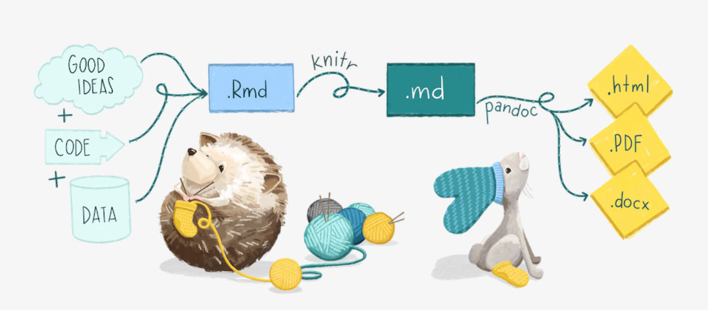

```{r child = "setup.Rmd"}
```

```{r packages, echo=FALSE, message=FALSE, warning=FALSE}
library(tidyverse)
library(openintro)
loans_full_schema <- loans_full_schema %>%
  mutate(grade = factor(grade, ordered = TRUE))
```

```{r xaringan-tile-view, echo=FALSE}
xaringanExtra::use_tile_view()
```

```{r xaringan-editable, echo=FALSE}
xaringanExtra::use_editable(expires = 1)
```

```{r xaringan-panelset, echo=FALSE, message=FALSE, warning=FALSE}
xaringanExtra::use_panelset()
xaringanExtra::style_panelset_tabs(panel_tab_font_family = "sans-serif")
```

```{r xaringanExtra-clipboard, echo=FALSE}
htmltools::tagList(
  xaringanExtra::use_clipboard(
    button_text = "<i class=\"fa fa-clipboard\"></i>",
    success_text = "<i class=\"fa fa-check\" style=\"color: #90BE6D\"></i>",
    error_text = "<i class=\"fa fa-times-circle\" style=\"color: #F94144\"></i>"
  ),
  rmarkdown::html_dependency_font_awesome()
)
```

```{r xaringan-fit-screen, echo=FALSE}
xaringanExtra::use_fit_screen()
```

```{r xaringan-extra-styles, echo=FALSE}
xaringanExtra::use_extra_styles(
  hover_code_line = TRUE,         #<<
  mute_unhighlighted_code = TRUE  #<<
)
```

```{css include=FALSE}
.panelset {
   --panel-tab-foreground: currentColor;
   --panel-tab-background: unset;
   --panel-tab-active-foreground: currentColor;
   --panel-tab-active-background: unset;
   --panel-tab-active-border-color: currentColor;
   --panel-tab-hover-foreground: currentColor;
   --panel-tab-hover-background: unset;
   --panel-tab-hover-border-color: currentColor;
   --panel-tab-inactive-opacity: 0.5;
   --panel-tabs-border-bottom: #ddd;
   --panel-tab-font-family: Sen;
   --panel-tab-background-color-active: #fffbe0;
   --panel-tab-border-color-active: #023d4d;
}

.panelset .panel-tabs .panel-tab > a {
	color: #023d4d;
}

.panelset .panel-tabs {
  font-size: 0.5rem;
}
```


class: center, middle

## Retrospecto

---

## Modelo conceitual da análise de dados


---

## Tipos de dados

- Os tipos de dados mais comuns são `character`, `numeric`, `factor`e `logical`.

## Tipos de classes de objetos no R

- As classes de organização dos dados mais comuns são `vector`, `list`, `matrix` e `dataframe`.


---

## RMarkdown

```{r echo=FALSE, out.width="100%"}

```
.footnote[
Alison Hill [Teaching in Production](https://rstudio-education.github.io/teaching-in-production/slides/index.html#1)
]

---

## ggplot2

- ggplot() é a função principal no ggplot2
- As parcelas são construídas em camadas
- A estrutura do código para as parcelas pode ser resumida como

```{r eval = FALSE}
ggplot(data = [dataset], 
       mapping = aes(x = [x-variable], y = [y-variable])) +
   geom_xxx() +
   other options
```

---

## Tidy data

>As famílias infelizes são todas iguais; cada família infeliz é infeliz à sua própria maneira. 
>
>Leo Tolstoy

---

.pull-left[
**Características dos dados tidy:**

- Cada variável forma uma coluna.
- Cada observação forma uma linha.
- Livre de linhas/colunas duplicadas.
- Livre de erros de ortografia
- Relevante (por exemplo, livre de caracteres especiais)
- O tipo de dados apropriado para análise
- Livre de outliers (ou só contém outliers que tenham sido identificados/entendidos), e
]
--
.pull-right[
**Características dos dados untidy:**

!@#$%^&*()
]

---

## 

.question[
O que faz com que estes dados não estejam arrumados?
]

```{r hyperwar-airplanes-on-hand, echo=FALSE, out.width="90%", fig.align = "center", caption = "WW2 Army Air Force combat aircraft", out.width = "70%"}
knitr::include_graphics("img/hyperwar-airplanes-on-hand.png")
```

.footnote[
Source: [Army Air Forces Statistical Digest, WW II](https://www.ibiblio.org/hyperwar/AAF/StatDigest/aafsd-3.html)
]

---

.question[
O que faz com que estes dados não estejam arrumados?
]

<br>

```{r hiv-est-prevalence-15-49, echo=FALSE, out.width="95%", fig.align = "center", caption = "Estimated HIV prevalence among 15-49 year olds", out.width = "70%"}
knitr::include_graphics("img/hiv-est-prevalence-15-49.png")
```

.footnote[
Source: [Gapminder, Estimated HIV prevalence among 15-49 year olds](https://www.gapminder.org/data)
]

---

.question[
O que faz com que estes dados não estejam arrumados?
]

<br>

```{r us-general-economic-characteristic-acs-2017, echo=FALSE, out.width="95%", fig.align = "center", caption = "US General Economic Characteristics, ACS 2017", out.width = "85%"}
knitr::include_graphics("img/us-general-economic-characteristic-acs-2017.png")
```

.footnote[
Source: [US Census Fact Finder, General Economic Characteristics, ACS 2017](https://factfinder.census.gov/faces/tableservices/jsf/pages/productview.xhtml?pid=ACS_17_5YR_DP03&src=pt)
]

---

## Exibição vs. resumo de dados

.panelset[

.panel[.panel-name[Saída]

.pull-left[
```{r echo=FALSE}
starwars %>%
  select(name, height, mass)
```
]
.pull-right[
```{r echo=FALSE}
starwars %>%
  group_by(gender) %>%
  summarize(avg_ht = mean(height, na.rm = TRUE))
```
]

]

.panel[.panel-name[Código]

.pull-left[
```{r eval=FALSE}
starwars %>%
  select(name, height, mass)
```
]
.pull-right[
```{r eval=FALSE}
starwars %>%
  group_by(gender) %>%
  summarize(
    avg_ht = mean(height, na.rm = TRUE)
    )
```
]

]

]


---

class: middle

# Gramática do data wrangling

---

## Gramática do data wrangling

Com base nos conceitos de funções como verbos que permitem a manipulação de dataframes

.pull-left[
```{r dplyr-part-of-tidyverse, echo=FALSE, out.width="70%", caption = "dplyr is part of the tidyverse"}
knitr::include_graphics("img/dplyr-part-of-tidyverse.png")
```
]
.pull-right[
.small[
- `select`: seleção de colunas pelo nome
- `arrange`: reorganização das colunas
- `slice`: seleção de linhas pelo index(es)
- `filter`: seleção de linhas segundo algum critério
- `distinct`: aplica um filtro para que não haja colunas duplicadas
- `mutate`: adição de novas variáveis
- `summarise`: redução de variáveis a valores
- `group_by`: operações em agrupamentos
- ... (many more)
]
]

---

## Regras das funções **dplyr**

- O primeiro argumento é **sempre** um dataframe
- Os argumentos subseqüentes dizem o que fazer com esse dataframe
- A saída é sempre um dataframe
- Não modifica os dados originais

---

## Dados: Reservas de hotéis

- Dados de dois hotéis: um resort e um hotel urbano
- Observações: Cada linha representa uma reserva de hotel
- Objetivo para a coleta de dados originais: Desenvolvimento de modelos de previsão para classificar a probabilidade de uma reserva de hotel ser cancelada ([Antonia et al., 2019](https://www.sciencedirect.com/science/article/pii/S2352340918315191#bib5))

[Dados](https://cefetmgbr-my.sharepoint.com/:x:/g/personal/renataoliveira_cefetmg_br/EUrBw09_G6BAhuASz0wyAEwBCl_pm5aHc5Ok8m4oAilz8w?e=qieY4H)

```{r message=FALSE}
library(readr)
hotels <- read_csv("./data/hotels.csv")
```

.footnote[
Source: [TidyTuesday](https://github.com/rfordatascience/tidytuesday/blob/master/data/2020/2020-02-11/readme.md)
]

---

## Primeiro olhar: Variáveis

.small[
```{r output.lines=18}
names(hotels)
```
]

---

## Segundo olhar: Visão geral

.small[
```{r output.lines=18}
glimpse(hotels)
```
]

---

## Selecione uma única coluna

Ver apenas `lead_time` (número de dias entre a reserva e a data de chegada):

```{r}
select(hotels, lead_time)
```

---

## Selecione uma única coluna

.pull-left[
```{r eval=FALSE}
select( #<<
  hotels, 
  lead_time
  )
```
]
.pull-right[
- Comece com a função (um verbo):  `select()`
]

---

## Selecione uma única coluna

.pull-left[
```{r eval=FALSE}
select( 
  hotels, #<<
  lead_time
  )
```
]
.pull-right[
- Comece com a função (um verbo): `select()`
- Primeiro argumento: dataframe com o qual estamos trabalhando, `hotels`.
]

---

## Select a single column

.pull-left[
```{r eval=FALSE}
select( 
  hotels, 
  lead_time #<<
  )
```
]
.pull-right[
.pull-right[
- Comece com a função (um verbo): `select()`
- Primeiro argumento: dataframe com o qual estamos trabalhando, `hotels`.
- Segundo argumento: variável que queremos acessar, `lead_time`
]

---

## Select a single column

.pull-left[
```{r}
select( 
  hotels, 
  lead_time
  )
```
]
.pull-right[
- Comece com a função (um verbo): `select()`
- Primeiro argumento: dataframe com o qual estamos trabalhando, `hotels`.
- Segundo argumento: variável que queremos acessar, `lead_time`
- Resultado: data frame com `r nrow(hotels)` linhas e 1 coluna
]

---

.tip[
dplyr funções precisam de um data frame como entrada e entregam um data frame.
]

```{r}
select(hotels, lead_time)
```

---

## Selecione várias colunas


Veja apenas o tipo de `hotel` e o `lead_time`:

--

.pull-left[
```{r}
select(hotels, hotel, lead_time)
```
]
--
.pull-right[
.question[
E se quiséssemos selecionar estas colunas, e depois organizar os dados em ordem decrescente conforme data?
]
]

---

## Data wrangling, passo-a-passo

.pull-left[
Selecione:
```{r}
hotels %>%
  select(hotel, lead_time)
```
]

--
.pull-right[
Selecione, depois organize:
```{r}
hotels %>%
  select(hotel, lead_time) %>%
  arrange(desc(lead_time))
```
]

---

class: middle

# Pipes

---

## O que é um pipe?

Na programação, `pipe` é uma técnica para passar informações de um processo para outro.

--

.pull-left[
- Comece com o dataframe `hotels`, e utilize a função `select()`,
]
.pull-right[
.small[
```{r}
hotels %>% #<<
  select(hotel, lead_time) %>%
  arrange(desc(lead_time))
```
]
]

---

## O que é um pipe?

Na programação, `pipe` é uma técnica para passar informações de um processo para outro.

.pull-left[
- Comece com o dataframe `hotels`, e utilize a função `select()`,
- e então, selecione `hotel` and `lead_time`,
]
.pull-right[
.small[
```{r}
hotels %>%
  select(hotel, lead_time) %>% #<<
  arrange(desc(lead_time))
```
]
]

---

## O que é um pipe?

Na programação, `pipe` é uma técnica para passar informações de um processo para outro.

.pull-left[
- Comece com o dataframe `hotels`, e utilize a função `select()`,
- e então, selecione `hotel` and `lead_time`,
- e então, organize de maneira decrescente conforme o `lead_time`.
]
.pull-right[
.small[
```{r}
hotels %>%
  select(hotel, lead_time) %>% 
  arrange(desc(lead_time)) #<<
```
]
]

---

## Além

O pipe é implementado no pacote **magrittr**, embora não precisemos carregar este pacote explicitamente, pois **tidyverse** faz isto por nós.

--

.question[
Algum palpite sobre o porquê do pacote ser chamado de magrittr?
]

--

.pull-left[
```{r magritte, echo=FALSE, out.width="90%", caption = "Magritte's pipe"}
knitr::include_graphics("img/magritte.jpg")
```
]
.pull-right[
```{r magrittr, echo=FALSE, out.width="100%", caption = "magrittr's pipe"}
knitr::include_graphics("img/magrittr.jpg")
```
]

---

## Como funciona o pipe?

- Você pode pensar na seguinte seqüência de ações - encontrar chaves, destravar o carro, ligar o carro, dirigir para o trabalho, estacionar.

--
- Expresso como um conjunto de funções aninhadas no pseudo-código R, isto pareceria:
```{r eval=FALSE}
park(drive(start_car(find("keys")), to = "work"))
```

--
- Escrevê-lo usando pipes dá-lhe uma estrutura mais natural (e mais fácil de ler):
```{r eval=FALSE}
find("keys") %>%
  start_car() %>%
  drive(to = "work") %>%
  park()
```

---

## Uma nota sobre pipes e estratificação

- utilizado principalmente em **dplyr** pipelines, *canalizamos a saída da linha de código anterior como a primeira entrada da próxima linha de código*.

--
- O `+` utilizado em **ggplot2** é utilizado para "estratificação", *criamos a parcela em camadas, separadas por `+`*

---

## dplyr

.midi[
`r emo::ji("x")`

```{r error=TRUE}
hotels +
  select(hotel, lead_time)
```

`r emo::ji("white_check_mark")`

```{r eval=FALSE}
hotels %>%
  select(hotel, lead_time)
```

.midi[
```{r echo=FALSE, output.lines=6}
hotels %>%
  select(hotel, lead_time)
```
]
]

---

## ggplot2

.midi[
`r emo::ji("x")`

```{r error=TRUE}
ggplot(hotels, aes(x = hotel, fill = deposit_type)) %>%
  geom_bar()
```

`r emo::ji("white_check_mark")`

```{r out.width="25%"}
ggplot(hotels, aes(x = hotel, fill = deposit_type)) +
  geom_bar()
```
]

---

## Estilo de código

Muitos dos princípios de estilo são consistentes entre `%>%` e `+`:

- sempre um espaço antes
- sempre uma quebra de linha depois (para dutos com mais de 2 linhas)

`r emo::ji("x")`

```{r eval=FALSE}
ggplot(hotels,aes(x=hotel,y=deposit_type))+geom_bar()
```

`r emo::ji("white_check_mark")`

```{r eval=FALSE}
ggplot(hotels, aes(x = hotel, y = deposit_type)) + 
  geom_bar()
```

